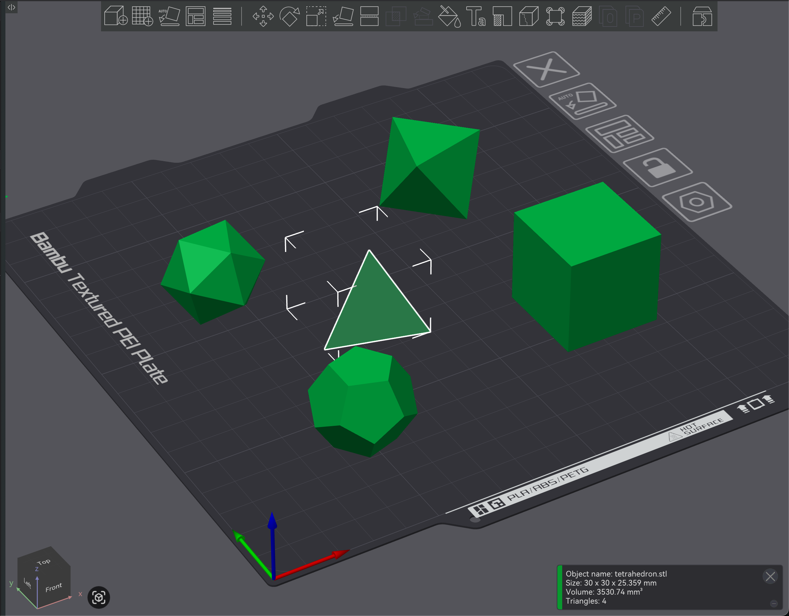

# PlatonicSolidsGenerator.jl



PlatonicSolidsGenerator.jl is a Julia package for generating Platonic solids,
visualizing them with Makie.jl, and exporting them as STL files for 3D printing.

The package is designed for workflows that import STL files into slicers such
as Bambu Studio. STL coordinates are treated as millimeters. Because STL files
do not store unit metadata, slicers should interpret the value passed to
`bbox_mm` as millimeters.

## Features

- Generate all 5 Platonic solids:
  - Tetrahedron `:tetrahedron` / `4`
  - Cube `:cube` / `6`
  - Octahedron `:octahedron` / `8`
  - Dodecahedron `:dodecahedron` / `12`
  - Icosahedron `:icosahedron` / `20`
- 3D visualization with Makie.jl
- Binary STL export
- Maximum bounding-box size control with `bbox_mm`
- Print-bed placement with `placement=:flat`
- `write_mesh` API prepared for future 3MF export support

## Provenance

This project was generated with Codex.

## Installation

To use this repository as a local package:

```julia
using Pkg
Pkg.develop(path="/path/to/PlatonicSolidsGenerator.jl")
```

To try it directly from this directory:

```sh
julia --project=.
```

```julia
using PlatonicSolidsGenerator
```

## Quick Start

### Export an STL File

```julia
using PlatonicSolidsGenerator

write_mesh("cube.stl", :cube; bbox_mm=30.0, placement=:flat)
write_stl("icosahedron.stl", :icosahedron; bbox_mm=40.0, placement=:flat)
```

`placement=:flat` places one face on the xy plane at `z=0` and ensures that all
vertices have `z >= 0`. This is convenient for STL files that will be imported
into slicers such as Bambu Studio.

### Visualize with Makie

```julia
using GLMakie
using PlatonicSolidsGenerator

fig = visualize_solid(:dodecahedron; bbox_mm=30.0, placement=:flat)
display(fig)
```

Choose the Makie backend in the consuming application. Load GLMakie, WGLMakie,
CairoMakie, or another backend before calling `visualize_solid`.

### Get a GeometryBasics.Mesh

```julia
using PlatonicSolidsGenerator

mesh = platonic_solid(20; bbox_mm=25.0)
```

`platonic_solid` returns a `GeometryBasics.Mesh` that can be passed to Makie's
`mesh!` and related APIs.

## Placement

`placement` accepts the following values:

- `:center`: The default. Places the solid around the origin. Use this for
  mathematical visualization and geometry checks.
- `:flat`: Places one face on the xy plane at `z=0`. Use this for 3D printing.

Example:

```julia
centered = platonic_solid(:tetrahedron; bbox_mm=30.0, placement=:center)
flat = platonic_solid(:tetrahedron; bbox_mm=30.0, placement=:flat)
```

## API

```julia
supported_solids()
platonic_solid(kind; bbox_mm=30.0, placement=:center)
visualize_solid(kind; bbox_mm=30.0, placement=:center, axis=true)
write_stl(path, kind; bbox_mm=30.0, placement=:center, name=nothing)
write_mesh(path, kind; bbox_mm=30.0, placement=:center, format=:auto, metadata=Dict())
```

`kind` can be specified as a symbol or by number of faces.

```julia
platonic_solid(:cube)
platonic_solid(6)
write_mesh("solid.stl", 12; bbox_mm=50.0, placement=:flat)
```

## 3MF Support

`.3mf` export is not implemented yet.

However, `write_mesh(path, kind; format=:auto)` recognizes the `.3mf` extension
as a planned future format and currently raises an explicit unsupported-format
error. The API is structured so a core 3MF writer can later be added on top of
the same internal mesh representation.

## Example

Generate STL files for all 5 supported solids under `exports/`:

```sh
julia --project=. examples/generate_solids.jl
```

Generated files:

```text
exports/tetrahedron.stl
exports/cube.stl
exports/octahedron.stl
exports/dodecahedron.stl
exports/icosahedron.stl
```

## Testing

```sh
julia --project=. -e 'using Pkg; Pkg.test()'
```

The tests cover:

- The list of supported Platonic solids
- Symbol-based and face-count-based solid selection
- Scaling with `bbox_mm`
- Bottom-face placement at `z=0` with `placement=:flat`
- Triangle counts and file sizes for binary STL output
- Explicit unsupported-format errors for `.3mf`
- Makie visualization smoke tests
